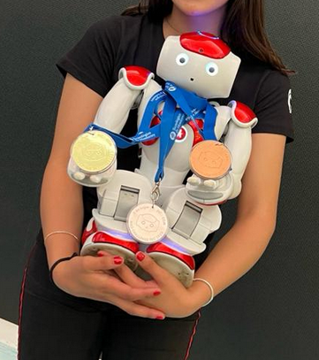
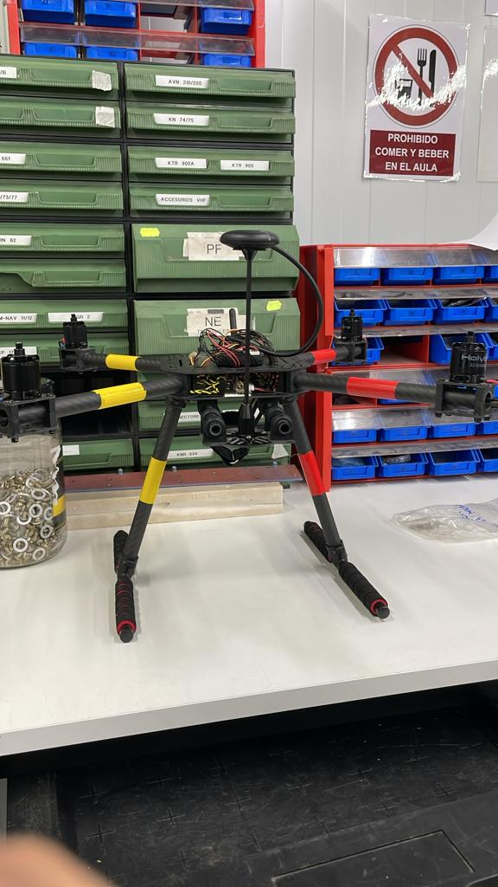

# Curriculum 

## Formación:

Licenciatura en Ingeniería Mecatronica con especialización en Inteligencia Robotica. Universidad Tecnologica de Monterrey campus Ciudad de México.
Certificación en Proccess symulate y experiencia internacional en España en la Universidad Rey Juan Carlos.

## Experiencia:

3 años como ingeniero en mecatronica en el Tec de Monterrey , enfocado en el desarrollo de robots, automatización, tecnologia, mecanica y termodinamica.
1 semestre de intercambio con estudios especializados en robotica software.

## Intereses:

Apasionada por la incorporación de nuevas tecnologías en el mundo asi como la interacción humano maquina y el bienestar social. Me interesan  los proyectos que buscan aplicar la inteligencia artificial y mecanica al igual que la parte electronica que facilitan la resolucion de  problemas en áreas como la salud, la sostenibilidad, educación, etc.

## Situación Actual:

Actualmente, soy estudiante apunto de graduarse con muchas metas y planes futuros, con experiencia en el mundo laboral en la elaboración de paginas web y colaborando con empresas durante la carrera y en proyectos como programadora para competencias en Nao.

## Fotos:
Fotos relevantes a mis proyectos 

## Intereses personales:

Amo viajar me gusta la musica, estuve en toda mi carrera en clases de canto, bachata, arabe, me gusta hacer ejercicio y estuve en varias presentaciones culturales durante la carrera.
